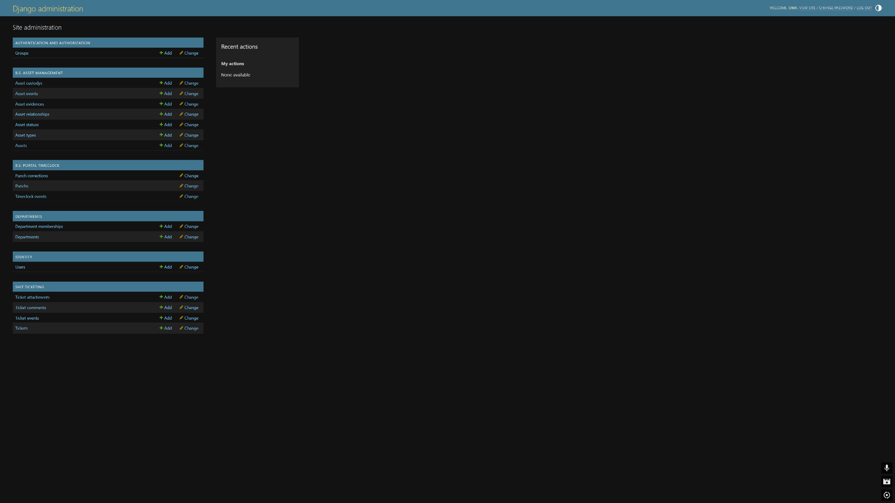

# B.S. Portal Administration Guide — v0.2.0-alpha

This guide covers administrative configuration that is intentionally outside ordinary operator workflows.

## 1. Django Admin

Staff users with the required Django permissions can reach `/admin/`. Superusers have full Django Admin authority.

Django Admin is the back-office control plane for reference/configuration data; ordinary daily asset/ticket operations should use BAM/SHIT interfaces so service-layer history and workflow rules are preserved.



## 2. Users

BSP uses a custom UUID-backed `identity.User` from the first migration. It extends Django's `AbstractUser` and adds `display_name`.

Important identity flags inherited from Django:

- `is_active` — account may authenticate/use BSP;
- `is_staff` — grants access to Django Admin subject to permissions and acts as a global operational agent in current alpha module checks;
- `is_superuser` — global Django permissions and BSP superuser-only data-management access.

### Packaged first administrator

A fresh packaged installation with no users opens `/setup/` on localhost and offers:

- create first administrator; or
- restore an existing `.bsbackup` instead.

Once any user exists, `/setup/` redirects to login and cannot be used to create another bootstrap admin.

## 3. Departments and memberships

`DepartmentMembership` roles:

- Member;
- Manager;
- Department administrator.

Membership is unique per user+department and has active/start/end metadata.

### Current alpha semantics

- SHIT treats any active department member as a department agent for ticket visibility/management.
- BAM request management is stricter: only Manager and Department administrator roles have department-scoped allocation authority.
- staff/superusers bypass these department-scoped restrictions globally.

This is the current alpha model, not the final production RBAC matrix.

## 4. BAM reference data

Django Admin manages:

- Asset types;
- Asset statuses;
- Assets;
- Asset relationships;
- Asset requests/items/events;
- Checkout records (read-only add/delete behavior for checkout rows);
- evidence/custody/event rows;
- BAM automation settings.

Use normal BAM workflows instead of manually fabricating checkout rows. `AssetCheckoutAdmin` intentionally disallows add/delete to reduce bypass of service logic.

### Seed command

To create the standard BAM asset types/statuses and SR69 department when absent:

```powershell
.\.venv\Scripts\python.exe portal\manage.py seed_bam --settings=config.settings.local
```

`get_or_create` is used, so existing reference rows are not overwritten.

## 5. BAM automation settings

There is one authoritative `BAMAutomationSettings` row (`pk=1`). Admin prevents multiple configuration rows.

### Stock custody

**Default custodian**
: User account representing stock/inventory custody. Configure Vanguard here for explicit behavior.

**Automation actor**
: Account written as actor for automatic BAM events. If empty, BAM uses default custodian, then the Vanguard fallback, then a service-supplied fallback actor.

### Automatic request handling

**Auto approve available requests**
: New/pending BAMR items may be automatically reserved/waitlisted according to availability.

**Allow equivalent substitution**
: `Prefer` requests may use another matching department/type asset if the preferred unit is unavailable.

**Auto transfer on approval**
: If an automatically approved reservation is active today, BAM may immediately issue checkout/custody to the requester.

### Queue/release automation

**Auto promote waitlist**
: BAM automation pulses/release flows may move compatible waitlisted work into reserved state when an asset becomes eligible.

**Auto transfer on release**
: After a good self-service release, an active approved reservation may immediately receive physical checkout.

### Recommended alpha defaults

For the intended self-running stockroom model:

- Default custodian: Vanguard;
- Automation actor: Vanguard (or a dedicated future automation service account);
- Auto approve: enabled;
- Equivalent substitution: enabled if department/type equivalence is acceptable;
- Auto transfer on approval: enabled;
- Auto promote waitlist: enabled;
- Auto transfer on release: enabled.

Disable individual switches when testing/manual control is desired.

## 6. Per-asset allocation policy

Asset **Edit details** contains:

- Allow automatic allocation;
- Allocation hold;
- Allocation hold reason.

Use automatic-allocation disabled for assets that require deliberate manager selection but remain otherwise usable. Use allocation hold when the asset should not be considered available at all.

## 7. Manual custody override

The BAM asset detail page exposes Manual Custody Override. Use it for corrections or unusual operational cases. It closes prior open custody history and writes new events.

Do not use it as a substitute for reservation-backed checkout when a BAMR exists, because the checkout record is what connects physical custody to the request/window/due date.

## 8. SHIT administration

Django Admin can inspect Ticket, TicketAssetLink, comments, attachments, and events depending on registered admin configuration. Ordinary status/assignment/asset-link actions should use SHIT pages so the service layer writes consistent timestamps/events.

## 9. Timeclock administration

Only staff users can access the normal punch-correction workflow. Corrections append rather than edit/delete original Punch rows.

## 10. Backup & restore authority

The in-app **Backup & restore** workspace is superuser-only. Restore replaces the current schema and may replace media, so it is intentionally not granted merely by staff or department-management status.

See [Backup & Restore](backup-restore.md).

## 11. Source-development migrations

The one-click development launcher **never auto-applies migrations**. When it reports pending migrations:

```powershell
.\.venv\Scripts\python.exe portal\manage.py showmigrations --plan --settings=config.settings.local
.\.venv\Scripts\python.exe portal\manage.py migrate --settings=config.settings.local
```

Review the migration before applying it to valuable data.

The packaged installer uses a different policy: it knows the release migration set, creates a database-only `.bsbackup` first, then applies the release migrations automatically.

## 12. BAM automation pulse

Manual source command:

```powershell
.\.venv\Scripts\python.exe portal\manage.py process_bam_automation --settings=config.settings.local
```

Use this after changing automation policy or when diagnosing a queue entry that appears eligible but remains waitlisted.

## 13. Security-sensitive administration

- Never commit `.env` or database/application secrets.
- Do not expose local `DEBUG=True` development instances to the internet.
- Treat `.bsbackup`, media, and logs as sensitive operational data.
- Packaged runtime secrets under ProgramData are machine-local and DPAPI-protected; they are intentionally excluded from portable backups.
- Do not manually edit MySQL tables to bypass service logic unless performing a documented recovery procedure.
