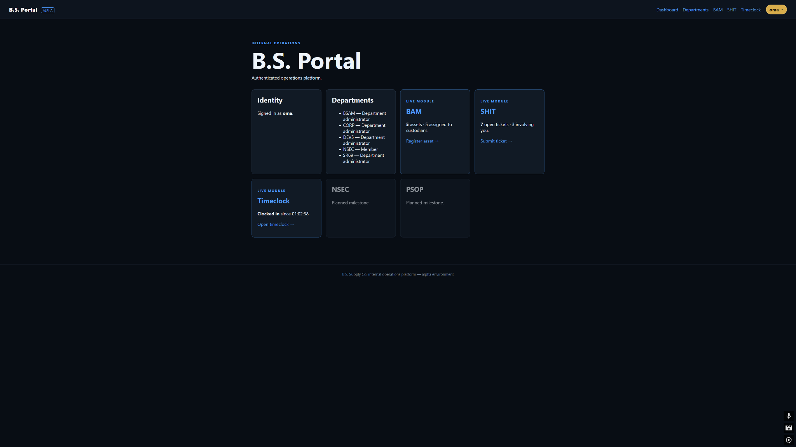
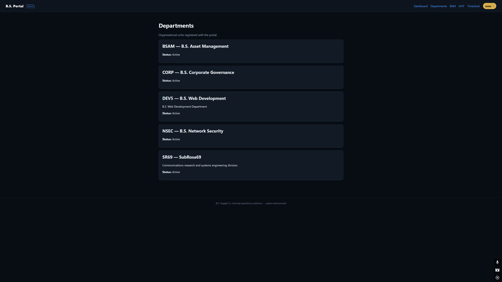
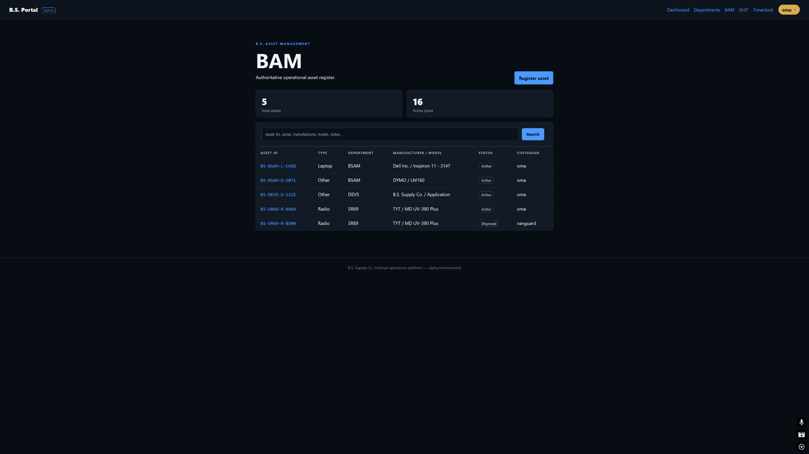
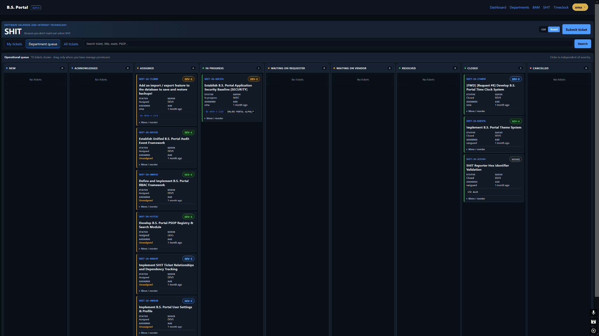
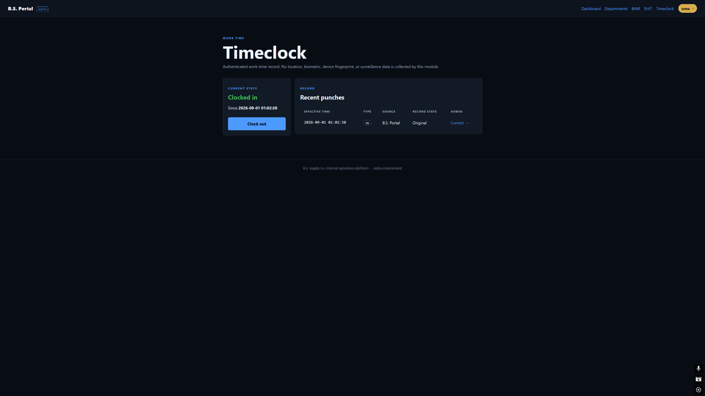

# B.S. Portal Operator Guide — v0.2.0-alpha

This guide covers ordinary day-to-day use of **B.S. Portal**. It deliberately separates operator workflows from administrator-only setup and developer commands. Detailed module guides are linked where a workflow becomes more involved.

> BSP is still alpha software. Use the event/history views and verified backups as part of normal operational discipline; do not treat the current UI as the final production security boundary.

## 1. Signing in and navigation

A normal authenticated session exposes the primary modules:

- **Dashboard** — personal and operational summary.
- **Departments** — department directory.
- **BAM** — assets, BAMR requests, queues, reservations, checkout/custody.
- **SHIT** — operational tickets.
- **Timeclock** — personal clock state and punch history.

The account menu also contains appearance controls and links to **About**, **Privacy**, **Security**, and **License**. Staff/superusers may see additional administration links.

### Browser preferences

The following non-sensitive UI preferences are stored in first-party browser storage and mirrored to a functional preference cookie where server-side first-render behavior is needed:

- theme;
- SHIT List vs Board;
- SHIT Dense vs Compact ticket-detail layout.

A browser with no SHIT view preference opens **Board** by default. SHIT scope (`My tickets`, `Department queue`, `All tickets`) is intentionally not persisted in v0.2.0-alpha.

### Toast notifications

Successful actions, warnings, validation failures, and errors appear as toast notifications in the upper-right of the portal. They dismiss automatically, can be closed manually, and pause while hovered. Error toasts remain longer than normal informational/success messages.

These are **not** cross-device or background push notifications; they display when a portal request returns a Django message to the current browser.

## 2. Dashboard

The Dashboard summarizes:

- your authenticated identity;
- active department memberships;
- BAM asset/request/checkout counts;
- open SHIT work and tickets involving you;
- current Timeclock state.

Use the module cards as shortcuts into BAM, SHIT, and Timeclock.



## 3. Departments

The Departments page is the organizational directory. It displays department code, name, description, and active status.

Membership is operationally important:

- SHIT uses active department membership to determine ticket visibility and management scope;
- BAM uses `Manager` and `Department administrator` memberships for department-scoped request/allocation authority.



Department/user administration is covered in the [Administration Guide](administration.md).

## 4. BAM — assets and resource requests

BAM is the authoritative asset register. A SHIT ticket may reference an asset, but BAM remains the source of truth for the asset itself, its status, custody, evidence, reservations, and checkout history.

### Find an asset

Open **BAM** and search by:

- asset ID;
- serial number;
- manufacturer;
- model;
- notes.



### Register an asset

Use **Register asset**. The current form records:

- department;
- asset type;
- lifecycle status;
- ownership (`Company` or `Managed personal`);
- manufacturer/model;
- serial number;
- optional explicit custodian;
- acquisition date;
- notes;
- optional asset photo and serial evidence;
- optional preferred 4-hex ID suffix.

Asset IDs use:

```text
BS-{DEPARTMENT}-{TYPE}-{4HEX}
```

Example:

```text
BS-SR69-R-6969
```

If the preferred suffix is already occupied inside the same organization/department/type namespace, BAM retries using a cryptographically random 4-hex suffix. The final database uniqueness constraint is authoritative.

For company-owned assets, leaving Custodian blank uses BAM's configured default stock custodian. If none is explicitly configured, BAM looks for an active account named `vanguard`.

### Asset record

An asset record can show:

- identity/type/department/ownership/status;
- manufacturer/model/serial;
- current custodian;
- acquisition/retirement dates;
- automatic-allocation policy and allocation hold;
- evidence and SHA-256 metadata;
- current reservation/checkout state;
- waitlist information visible to you;
- SHIT references visible to you;
- checkout history;
- custody history;
- asset event history.

Use **Edit details** for mutable descriptive fields. Asset ID, department, and asset type are intentionally not changed through the ordinary edit form in this alpha release.

### Request this asset

Use **Request this asset** from an asset record when you need equipment for a project/work window. This creates a **BAMR**, not a SHIT ticket.

A BAMR records:

- purpose;
- optional related SHIT ticket;
- BAM priority (`Normal`, `Time-sensitive`, `Critical dependency`);
- requested start and end date;
- optional desired project-completion date;
- justification;
- one or more resource requirements.

BAM priority is independent from SHIT severity and does not automatically jump the queue.

For each requirement choose:

- **Any suitable asset** — any eligible asset in the requested department + asset type may satisfy it.
- **Prefer this asset; allow equivalent** — use the preferred unit if eligible; otherwise automation may substitute another eligible equivalent when policy allows.
- **Require this exact asset** — no substitute; queue for that exact unit when unavailable.

If the requested asset/resource is available and automation is enabled, BAM can automatically reserve it and, when the requested window is active today, automatically check it out and change custody to the requester. If no eligible asset is available, the requirement enters the BAM queue.

A BAM request may include several requirements so a single project can request, for example, a laptop + SDR + radio without creating several SHIT tickets.

### Reservation, checkout, and custody are different

- **Reservation** means the resource is committed for a date window.
- **Checkout** means the asset has actually been issued.
- **Custodian** is the account currently responsible for the asset.

A future reservation does not claim the requester physically possesses the asset early. When an active reservation is checked out, the checkout workflow transfers custody.

### Releasing your asset

If you are the current custodian of an active reservation-backed checkout, **My Checkouts** gives you a self-service release action. Choose the return condition:

- Good / ready for next user;
- Minor issue;
- Damaged;
- Missing accessory;
- Needs attention.

A good release may automatically promote and transfer the asset to the next eligible request. If nobody is waiting, custody returns to the configured stock custodian (normally Vanguard).

A non-good release places the asset on **allocation hold** and returns it to stock custody so it is not immediately reissued.

For all BAM behavior, see the [BAM Guide](bam-guide.md).

## 5. SHIT — operational tickets

SHIT is for operational work, incidents, requests, changes, problems, documentation work, and similar tracked activity. Routine resource reservation belongs in BAMR rather than creating a second SHIT ticket solely to stand in line for equipment.

### Ticket identifiers

Tickets use immutable identifiers:

```text
SHIT-YY-HHHHHH
```

where the final six characters are uppercase hexadecimal.

### Create a ticket

Use **Submit ticket** and provide:

- title;
- description;
- ticket type;
- severity;
- optional destination department;
- optional multiple related BAM assets;
- one initial relationship type for those selected assets;
- optional PSOP/document identifier;
- optional initial attachment.

Ticket types include Incident, Service request, Access request, Change request, Problem, PSOP/documentation, Feedback/note, and Other.

Severity supports `NONE` and `SEV-5` through `SEV-1`.

### List and Board

SHIT supports:

- **Board** — default for a new browser preference;
- **List** — conventional searchable table.

The Board contains all implemented ticket statuses:

- New;
- Acknowledged;
- Assigned;
- In progress;
- Waiting on requester;
- Waiting on vendor;
- Resolved;
- Closed;
- Cancelled.

Horizontal movement changes the actual ticket status through the same service logic as the management form. Vertical movement changes **queue order only**; it does not change severity.



### Ticket scope

- **My tickets** — tickets where you are requester or assigned user.
- **Department queue** — tickets assigned to your active departments.
- **All tickets** — available only to staff/superusers; non-staff requests for All fall back to My tickets.

Search matches ticket number, title, description, related document, and linked BAM asset ID/manufacturer/model.

### Multiple linked assets

A ticket can reference several BAM assets. Relationship types are:

- Related;
- Affected asset;
- Required for work;
- Test equipment;
- Replacement / alternate;
- Supporting resource.

A ticket↔asset link is informational/operational context. It does **not** reserve or check out the asset. Use the BAM request flow for actual allocation.

### Comments and attachments

Ticket viewers may add requester-visible comments and attachments. Only ticket managers/agents may add **Internal note** comments. Attachments store metadata including SHA-256.

`v0.2.0-alpha` does **not** automatically turn a typed asset/ticket ID inside comment prose into a relationship. Use the explicit asset relationship controls.

For all SHIT behavior, see the [SHIT Guide](shit-guide.md).

## 6. Timeclock

Open **Timeclock** to see your effective clock state and recent punches.

- You may clock only yourself in or out.
- Duplicate consecutive states are rejected (for example, clocking in while already clocked in).
- Original Punch rows are immutable.
- Staff corrections are appended as separate correction records; the latest correction determines the effective punch type/time.



See the [Timeclock Guide](timeclock-guide.md).

## 7. Permissions and visibility

### SHIT

Staff/superusers can see all tickets. Otherwise, you can see a ticket when you are:

- its requester;
- its assigned user; or
- an active member of its assigned department.

Management requires staff/superuser, assigned user, or active membership in the assigned department. Requester status alone does not grant ticket-management authority.

### BAM requests

You may see your own BAMRs. Staff/superusers have global visibility. Department Managers/Department administrators can see/manage request requirements in departments they manage.

Whole-request actions require authority across **every department represented in the request**. Item-level actions are department-scoped.

BAM/SHIT backlinks are permission-filtered; a visible asset or ticket does not automatically reveal a request/ticket that the same user cannot open.

## 8. Backup & restore

Superusers can use **Account → Administration → Backup & restore** to create a `.bsbackup` containing the MySQL database and, by default, uploaded media.

For portable migration or disaster-recovery details, read [Backup & Restore](backup-restore.md) before importing anything.

## 9. Packaged Windows application

A packaged release runs locally at `http://127.0.0.1:8765/`, uses a private MySQL service on port `33069`, and keeps persistent state in ProgramData. The system tray provides:

- Open B.S. Portal;
- Backup & restore;
- View logs;
- Exit.

See [Windows Packaged Release](windows-release.md).

## 10. Getting help / troubleshooting

Use [Troubleshooting](troubleshooting.md) for pending migrations, missing tables, stuck BAM queues, MySQL client discovery, backup restore failures, packaged-service problems, and test-database setup.
