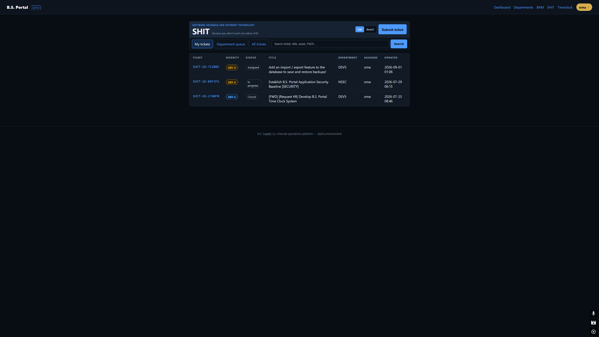
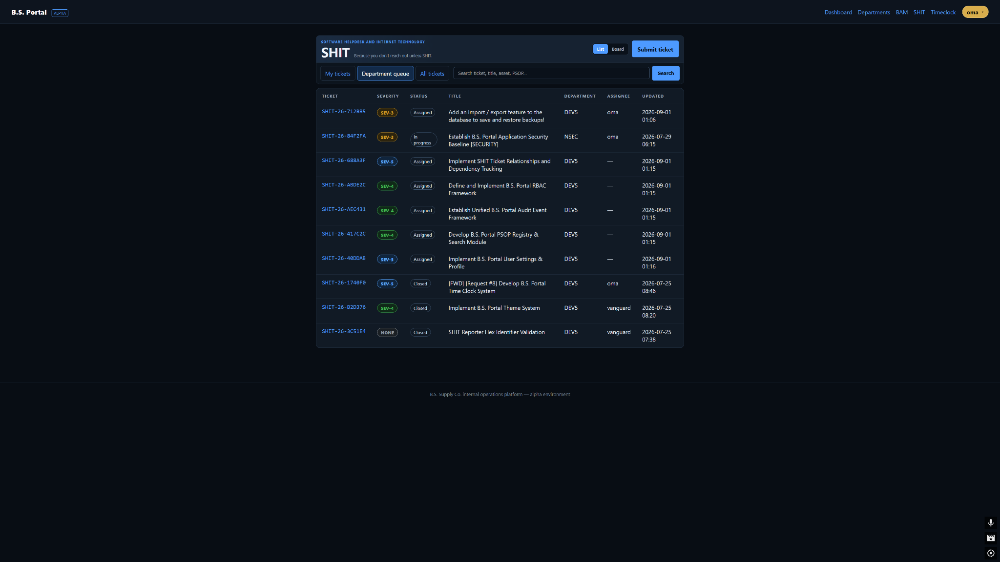
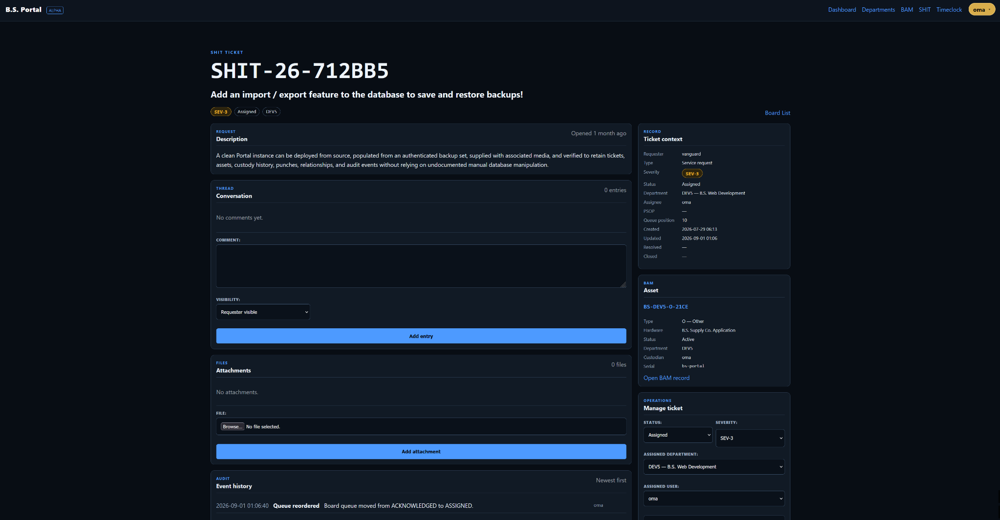

# B.S. Portal Operator Guide

This guide explains the day-to-day use of **B.S. Portal (BSP)**. It is written for people using the portal as an internal operations tool rather than for developers deploying or modifying the codebase.

> **Alpha documentation:** BSP is still under active development. Screenshots and labels may change as modules are refined. Operational records and permissions remain authoritative even when the presentation changes.

## Contents

- [Portal overview](#portal-overview)
- [Dashboard](#dashboard)
- [Departments](#departments)
- [BAM — B.S. Asset Management](#bam--bs-asset-management)
- [SHIT — Software Helpdesk and Internet Technology](#shit--software-helpdesk-and-internet-technology)
- [Timeclock](#timeclock)
- [Permissions and visibility](#permissions-and-visibility)
- [Django administration](#django-administration)
- [Common workflows](#common-workflows)

## Portal overview

BSP is the authenticated internal operations portal for B.S. Supply Co. The primary navigation currently exposes:

- **Dashboard** — account, department, asset, ticket, and timeclock summaries.
- **Departments** — the organizational units registered in BSP.
- **BAM** — authoritative asset records, custody, evidence, and asset history.
- **SHIT** — service/helpdesk tickets, operational queues, comments, attachments, and ticket history.
- **Timeclock** — personal clock-in/clock-out state and punch history.

The account control at the right side of the navigation identifies the signed-in user. Access to operational pages requires authentication.

## Dashboard

The Dashboard is the starting point for BSP. It summarizes the information most useful to the signed-in user:

- the currently authenticated identity;
- active department memberships and membership roles;
- total BAM asset count and the number currently assigned to custodians;
- open SHIT tickets and tickets involving the current user;
- current Timeclock state.

The BAM, SHIT, and Timeclock cards link directly into their respective modules. NSEC and PSOP may appear as planned/inactive modules while those workflows are still being implemented.

*The Dashboard acts as the authenticated landing page and quick-launch surface for the live modules.*

## Departments

The **Departments** page is the portal's current organizational directory. Each entry shows:

- department code;
- department name;
- description, when defined;
- active/inactive status.

The current alpha page is primarily informational. Department creation and administrative maintenance are not exposed as ordinary operator controls on this screen.

Department membership matters elsewhere in BSP. In particular, an active membership can determine which SHIT department queues a user can see and manage.

*Departments are currently presented as a clean reference directory rather than a heavy administration console.*

## BAM — B.S. Asset Management

BAM is the authoritative asset register. SHIT links to BAM records rather than copying asset data into tickets.

### Finding an asset

Open **BAM** from the navigation bar. The asset list supports search by:

- asset ID;
- serial number;
- manufacturer;
- model;
- notes.

The table displays the asset's ID, type, owning department, manufacturer/model, lifecycle status, and current custodian. Select an asset ID to open the authoritative record.

*The BAM list view is the main search/index surface for asset records.*

### Registering an asset

Use **Register asset** from the BAM page. Complete the intake form and commit the record.

BAM generates the final asset identifier when the record is committed. If the form offers a preferred hexadecimal suffix, BSP will attempt to use it. If that suffix is already assigned, BAM selects another unused suffix rather than overwriting an existing identifier.

An asset can also be registered with supporting evidence such as an asset photo or serial-number evidence where the intake form provides those fields.

### Asset record

An asset record combines current state with append-oriented history. Depending on the record and your current alpha permissions, the page can include:

- asset type and department;
- ownership;
- lifecycle status;
- manufacturer, model, and serial number;
- current custodian;
- acquisition/retirement dates;
- notes;
- evidence files and SHA-256 metadata;
- custody history;
- asset event history.

### Editing an asset

Use **Edit details** for mutable descriptive fields. In the current alpha workflow, the issued asset ID, department, and asset type are intentionally not edited through this form.

### Changing lifecycle status

Use **Change Status** on the asset record. Supply the new lifecycle status and a reason when required. The service records the change in asset history.

### Assigning custody

Use **Assign Custody** to change the current custodian. Custody changes are retained in the custody history rather than replacing the historical record.

### Evidence

Use **Evidence** to attach supporting files to the asset. Evidence entries retain file metadata including the original filename, upload information, size, and SHA-256 digest.

## SHIT — Software Helpdesk and Internet Technology

SHIT is BSP's service-management and internal ticketing module. The List and Board interfaces operate on the **same Ticket records**; they are two views of the same workflow, not separate ticket systems.

### Ticket scopes

The ticket workspace provides three scope controls where permitted:

- **My tickets** — tickets requested by or directly assigned to you.
- **Department queue** — tickets assigned to departments in which you have an active membership.
- **All tickets** — global ticket visibility for staff/superuser accounts.

The search box can match ticket number, title, description, related PSOP/document reference, or linked BAM asset ID.

### List versus Board

Use the **List / Board** control to choose the interface that fits the task.

**List** is intended for search, filtering, auditing, and scanning large numbers of records.

*List view with a small result set: useful for direct lookup and quick administrative review.*

*List view with a larger result set: better for broad scanning, sorting, and auditing than a board layout.*

**Board** is the operational queue: what is being worked, which state it is in, and its manual order within that state.

*The Board view uses most of the available workstation width and preserves the portal's actual ticket statuses as columns.*

The current board statuses are:

1. New
2. Acknowledged
3. Assigned
4. In Progress
5. Waiting on Requester
6. Waiting on Vendor
7. Resolved
8. Closed
9. Cancelled

### Board movement and queue order

For tickets you are authorized to manage:

- **horizontal movement** changes the ticket's real status;
- **vertical movement** changes only its manual queue position within that status.

Queue order and severity are independent. Moving a SEV-3 ticket lower in the queue does **not** turn it into a different severity.

Board-driven status changes use the same backend ticket-update service as ordinary status changes. Status changes and queue reorders therefore remain part of ticket history rather than existing only in browser state.

If drag/drop JavaScript is unavailable, the board still provides ordinary form controls for status movement and Up/Down queue ordering.

### Creating a ticket

Select **Submit ticket**. The create workbench collects the initial request information, including the fields supported by the current model:

- summary/title;
- description;
- ticket type/classification;
- severity;
- assigned department;
- related BAM asset, when applicable;
- related PSOP/document reference;
- initial attachment, when supplied.

New tickets use the existing creation workflow rather than bypassing it. The ticket begins in the normal initial status and assignment can subsequently be managed through the ticket record.

When linking an asset, search/select the existing BAM record. Do not create duplicate asset information inside the ticket description merely to reproduce BAM fields.

### Ticket detail workbench

Open a ticket number or board card to reach the ticket detail page.

*The ticket detail workbench separates the request/thread/files/history from ticket context, BAM context, and management controls.*

The current detail interface is organized around:

- **header summary** — ticket ID, title, severity, state, department, assignment and quick operational facts;
- **Description** — the original request body;
- **Conversation** — requester-visible comments and, for ticket managers, internal notes;
- **Attachments** — files associated with the ticket, including recorded SHA-256 metadata;
- **Event history** — operational/audit events for users allowed to manage the ticket;
- **Ticket context** — type, status, severity, assignment, queue position and timestamps;
- **BAM context** — linked asset summary and a direct link to the authoritative BAM record;
- **Manage ticket** — operational fields such as status, severity, department, assignee, asset, and document reference.

The newest UI also provides **Dense / Compact** presentation controls in the detail header:

- **Dense** keeps the context, BAM, and management information expanded for wide workstation displays.
- **Compact** converts the sidebar into collapsible sections and gives more space to the request/thread area.

BSP defaults toward Dense on wider displays and Compact on narrower desktop/tablet widths, but the operator can override the presentation using the header control.

### Comments and internal notes

Any user who can view a ticket can add a requester-visible comment.

Users with ticket-management permission can additionally mark an entry as an **internal** note. Internal notes are not shown to ordinary requester-only viewers.

### Attachments

Users who can view a ticket can attach files to it. Stored attachment records include file metadata such as the original filename, size, uploader, timestamp, and SHA-256 digest.

### Managing a ticket

If you have management permission, the **Manage ticket** section can update the fields exposed by the existing ticket-management form, including:

- status;
- severity;
- assigned department;
- assigned user;
- related BAM asset;
- related document / PSOP reference.

Use these controls rather than attempting to encode workflow state in comments or ticket titles.

## Timeclock

Timeclock records authenticated work-time punches for the current user. The module intentionally does not use location, biometric, device-fingerprint, or surveillance data.

*Timeclock shows current state on the left and recent punches on the right.*

### Clocking in

Open **Timeclock** and check the **Current State** card. When clocked out, select **Clock in**. BSP records the punch and updates the current state.

### Clocking out

When currently clocked in, the same page displays the time at which the current work period began. Select **Clock out** to append the matching punch.

### Punch history

The Timeclock page shows recent punches with:

- effective timestamp;
- punch type;
- source;
- original/corrected record state.

Corrections do not destroy the original punch. The effective value is derived from the original record plus append-only correction records.

### Correcting a punch

Punch correction is currently restricted to staff accounts. Staff can select **Correct** beside a punch, review the original record, provide the corrected type/time and a reason, and record the correction.

The original punch remains preserved and the correction is added to the audit trail.

## Permissions and visibility

BSP is authenticated, but permissions are module-specific and still being hardened as part of the alpha.

### SHIT

A ticket is currently viewable when a user is any of the following:

- staff or superuser;
- the requester;
- the directly assigned user;
- an active member of the assigned department.

Ticket-management permission is narrower. A requester does not gain management rights merely by having submitted the ticket. Management is currently available to:

- staff or superusers;
- the directly assigned user;
- active members of the assigned department.

This distinction is why some users can participate in the conversation and add attachments without seeing ticket-management or internal-note controls.

### BAM

The present BAM views are authenticated alpha workflows. Final production RBAC separation for asset registration, status, custody, evidence, and record maintenance remains part of the portal's hardening work.

### Timeclock

Users operate their own clock state and see their own recent punches. Punch correction is staff-only.

## Django administration

Django admin remains available for low-level administrative access and data maintenance. It is useful for development, seeding, inspection, and break-glass administration, but it is **not** the normal operator workflow for day-to-day BSP usage.

*Django admin exposes the underlying models directly and should generally be treated as an administrative back-office tool rather than the preferred operational interface.*

In practice, ordinary operations should favor:

- **Dashboard** for summary/navigation;
- **BAM** for asset workflows;
- **SHIT** for service workflows;
- **Timeclock** for punch workflows.

Reserve Django admin for users who specifically need direct administrative access and understand the implications of modifying records at the model level.

## Common workflows

### Report a problem with an existing asset

1. Open **SHIT**.
2. Select **Submit ticket**.
3. Enter the problem summary and description.
4. Choose the appropriate ticket type and severity.
5. Select the responsible department.
6. Search for and link the existing **BAM asset**.
7. Add an initial attachment if useful.
8. Submit the ticket.
9. Use the ticket detail page for follow-up comments/files.

The BAM record remains authoritative for asset identity and custody; the SHIT ticket contains the operational work surrounding the issue.

### Work a department queue

1. Open **SHIT**.
2. Choose **Department queue**.
3. Switch to **Board** for active operational work.
4. Review severity and assignment separately from queue position.
5. Move a ticket horizontally when its actual workflow status changes.
6. Reorder vertically when priorities within the same status need to change.
7. Open the ticket for comments, attachments, BAM context, management controls, and event history.

### Look up equipment before taking action

1. Open **BAM**.
2. Search by asset ID, serial number, manufacturer, model, or notes.
3. Open the asset record.
4. Review current status, department, custodian, evidence, custody history, and asset history.
5. If operational work is required, create/link a SHIT ticket rather than placing helpdesk workflow inside the BAM notes field.

### Correct a time punch

1. Open **Timeclock**.
2. Locate the punch in Recent punches.
3. Staff users select **Correct**.
4. Verify the original record shown on the correction page.
5. Enter the corrected type/time and a reason.
6. Record the correction.
7. Confirm the punch now shows its corrected effective state and retained audit detail.

## For developers and administrators

This guide intentionally does not duplicate local setup, migration, deployment, or architecture instructions.

See the repository [`README.md`](../README.md), [`development/`](development/), [`architecture/`](architecture/), and [`adr/`](adr/) documentation for those topics.
